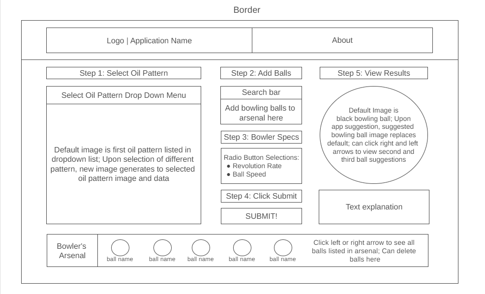

# PinPoint Perfection

## Background
    
PinPoint Perfection is a bowling application tool that can be used by both novice and experienced bowlers.
This application generates bowling ball recommendations by analyzing an oil pattern that a bowler has selected, 
two simple bowler attributes, and the bowling balls listed in the bowler's current arsenal.

To generate a recommendation, a bowler will take a few easy-to-follow-steps, click submit, and instantly receive their bowling ball recommendation for their selected oil pattern. If a bowler wishes to see other options, they simply need to click the arrows on the resulting bowling ball image.

## Functionality and MVPs

In PinPoint Perfection, users will be able to: 
- Search a dropdown menu for a desired oil pattern and pattern specs
- Add a list of bowling balls to their arsenal through search and auto fill option 
- Delete bowling balls from their arsenal 
- Scroll left and right through arsenal list 
- Submit inputted information for customized bowling ball recommendation 
- Receive customized bowling ball recommendation 
- Click through recommendations 

### In addition, this project will include:
- About the app section 
- Step by step user instructions
- Must press browser "refresh" button to clear or reset recommendation if recommendation has been generated 
- README.md
   
## Future functionality
- Option for bowler to record scores on specified oil pattern with recommended ball 

## Wireframe

Current mockup of interface, subject to change. 

Created using Wireframe.cc
https://wireframe.cc/LOPMub

## Technologies, Libraries, APIs
- Canvas
- CSS

## Implementation Timeline

- Friday Afternoon:
    - Finalize which technologies I will be using 
    - Setup initial project shell
    - Review Javascript lecture notes to further familiarize myself with steps needed to code project 
    - Begin coding basic functionality for Recommendation instance 
    - Test 

- Weekend
    - Find all desired oil patterns for pattern library and convert to JSON files
    - Find all desired bowling ball files for ball library and convert to JSON files
    - Find and save all corresponding images for aforementioned files 
    - Continue coding basic functionality if needed 
    - Test 
    - begin coding ball recommendation logic 
    - Test

- Monday 
    - Continue coding recommendation logic
    - Finish logic 
    - Attempt to begin styling 

- Tuesday
    - Styling 

- Wednesday 
    - Styling 

- Thursday 
    - Polish
    - Push to GitHub 
    - Present 

## Live Project

- Live Link: https://lynsiearagon.github.io/PinPointPerfection/
- GitHub: https://github.com/Lynsiearagon
- LinkedIn: https://www.linkedin.com/in/lynsie-aragon-87156a157

☐ Landing page/modal with obvious, clear instructions.

☐ Interactivity of some kind.

☐ Well styled, clean frontend.

☐ If it has music, the option to mute or stop it.

## Production README

## Link to live version.

- https://lynsiearagon.github.io/PinPointPerfection/

## Instructions on how to play/interact with the project.
1. Select the oil pattern you are bowling on.
2. Search and enter all bowling ball names that you own. Click "add". You will see them populate in the "Arsenal" list at the bottom of the page.
3. Select your specs: Rev rate, Ball Speed.
4. Click "Get Results!"
5. See Results.

## List of technologies / libraries / APIs used.

## Technical implementation details with (good-looking) code snippets.

## To-dos / future features.
- Get functionality working
- Add a section where bowler can track scores

☐ No .DS_Store files / debuggers / console.logs.

☐ Organized file structure, with /src and /dist directories.